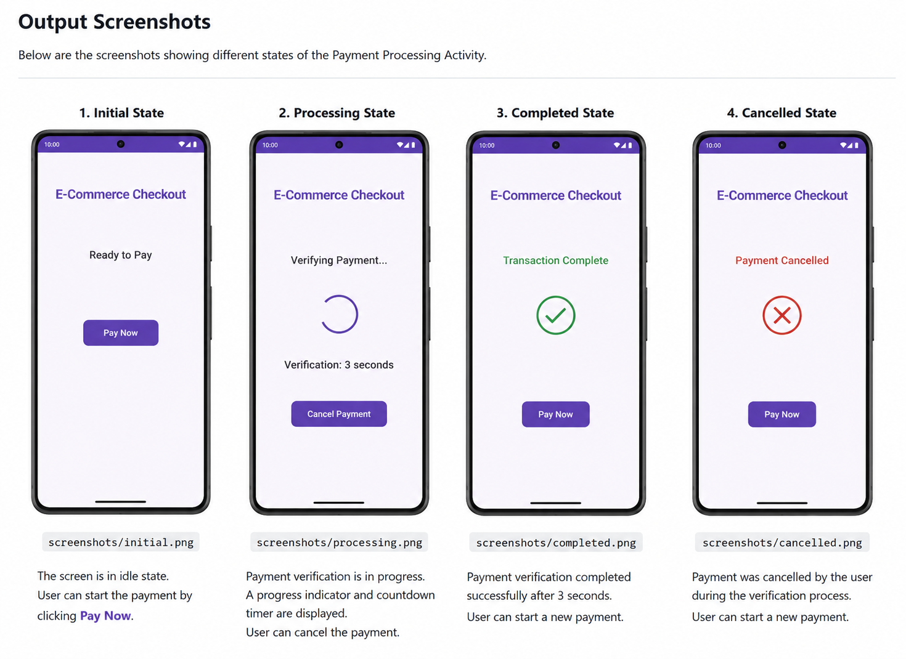

# Payment Processing Activity

A payment processing interface developed using **Kotlin and Jetpack Compose**. 
The project demonstrates state-driven payment verification using `LaunchedEffect` and Kotlin Coroutines, including a cancellable 3-second verification process.

## Problem Statement

Develop an e-commerce checkout interface where clicking **Pay Now** initiates a 3-second payment verification process.

The implementation must:

- Start the verification process when `isProcessing` becomes `true`.
- Display a progress indicator and active verification timer.
- Prevent repeated payment triggers while processing.
- Provide a **Cancel Payment** option during verification.
- Cancel the running coroutine when `isProcessing` changes to `false`.
- Display **Transaction Complete** only when verification finishes successfully.
- Prevent stale UI updates after cancellation.

## Implementation

The payment process is implemented as a Jetpack Compose `@Composable` using:

- **Kotlin** – Application development
- **Jetpack Compose** – Declarative UI development
- **Material 3** – UI components
- **Kotlin Coroutines** – Asynchronous payment verification
- **LaunchedEffect** – State-driven side-effect management
- **remember / mutableStateOf** – UI state management
- **delay()** – 3-second verification and countdown
- **CircularProgressIndicator** – Processing indicator
- **@Preview** – Compose UI preview

## How It Works
## Output

The following screenshots demonstrate the complete payment flow of the application.



### Payment Flow

1. **Initial State** – The application starts with the `Ready to Pay` status.
2. **Payment Verification** – Clicking `Pay Now` starts the 3-second verification process with a progress indicator and countdown timer.
3. **Transaction Complete** – After successful verification, the status changes to `Transaction Complete`.
4. **Payment Cancelled** – Clicking `Cancel Payment` stops the verification process and displays `Payment Cancelled`.

### 1. Initial State

The application starts with:

```text
E-Commerce Checkout

Ready to Pay

[ Pay Now ]
